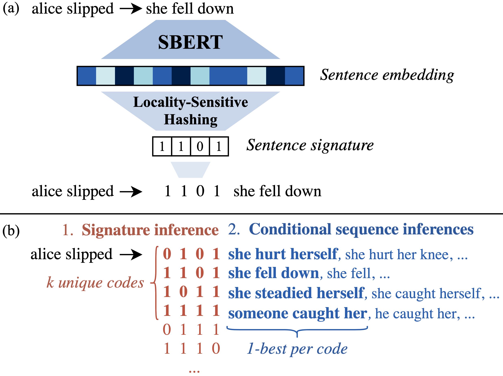

# COD3S
This repository houses the cod3 for 
 - [Nathaniel Weir, Joao Sedoc, and Benjamin Van Durme (2020): 
   COD3S: Diverse Generation with Discrete Semantic Signatures.](https://arxiv.org/pdf/2010.02882.pdf) In _Proceedings of EMNLP_.
   
We train seq2seq models for the purpose of diverse causal generation by generating semantic similarity-preserving LSH bit signatures of sentences' SBERT embeddings. 

 


## Installation
1. This repository uses [conda](https://docs.conda.io/en/latest/miniconda.html) to manage packages and [Ducttape](https://github.com/jhclark/ducttape) to manage intermediate results 
of the experiment pipeline. Follow the latter's [quickstart guide](https://github.com/jhclark/ducttape#quick-start) to add ducttape to your path. 
   * Note that the tapes will download and pip install `fairseq` for you from the fork at `https://github.com/nweir127/fairseq-COD3S.git`. 

2. `git clone git@github.com:nweir127/COD3S.git`
3. `cd COD3S && conda env create -f environment.yml && conda activate cod3s`
4. edit `tapes/main.tape` to point the `COD3S` package to your local repo and `gpu_id` to your visible devices ids.


## Running Experiments
To run a task, run `ducttape tapes/main.tape -p <TASK>`, where task is one of the following:

| Task           | Description                                                      |
|----------------|------------------------------------------------------------------|
| `download_data`| downloads the training and evaluation data              |
| `download_cod3d_data` | download pre-cod3d (16 bits) causalbank data |
| `download_human_eval` | download 100-item evaluation sets from COPA and Causalbank, plus outputs from other Li et al. models used in human evaluation |
| `compute_cod3s`  | Computes LSH signatures of all training and evaluation data      |
| `train`   |    Train forward/backward models on downloaded cod3d data       |
| `generate` | Run sequence inferences over COPA and Causalbank as shown in figure 2 of paper -- comment out `reach` statements in `inference.tape` to only run a subset|
| `generate_cod3s` | Download pretrained COD3S model and run COD3S+RS+MMI | 
| `generate_seq2seq` | Download pretrained COD3S model and run seq2seq baseline | 

### Notes
1. Whenever you run a task, ducttape will spit out a `ducttape_task.sh` script in the task's directory that you can use/modify to fit your use case.
2. Tasks will automatically run the other tasks required by their dependencies (`train` will run `download_data` etc).
### Automatic Diversity Evaluation
To run automatic diversity evaluation after generation:
`CUDA_VISIBLE_DEVICES=<device> PYTHONPATH=. python src/scripts/diversity_evaluation.py --results_dir=exp`


## Citation

If you use any of this codebase in your work, please cite our paper:

```
@inproceedings{weir-etal-20-cod3s,
    title = "{COD3S}: diverse generation with discrete semantic signatures",
    author = "Weir, Nathaniel  and
      Sedoc, Jo{\~a}o  and
      Van {D}urme, Benjamin",
    booktitle = "Proceedings of the 2020 Conference on Empirical Methods in Natural Language Processing (EMNLP)",
    month = nov,
    year = "2020"
}
```
